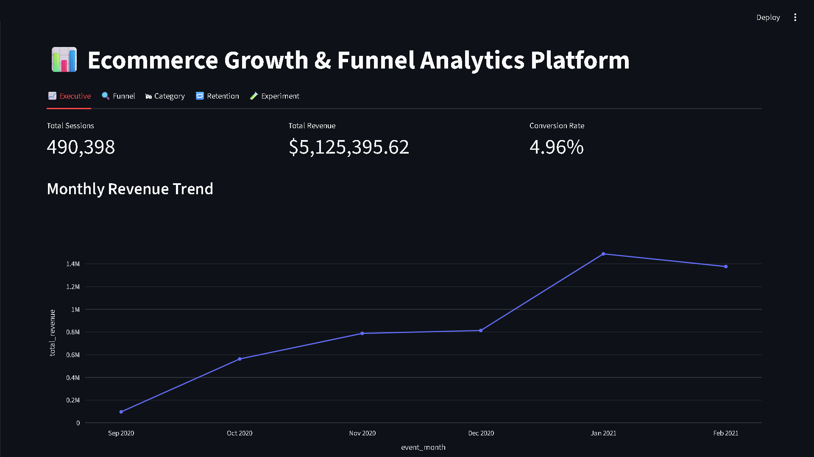
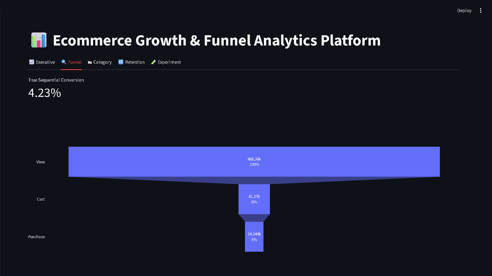
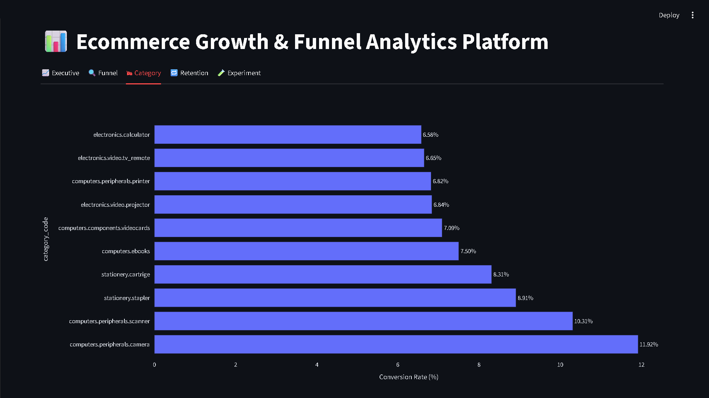
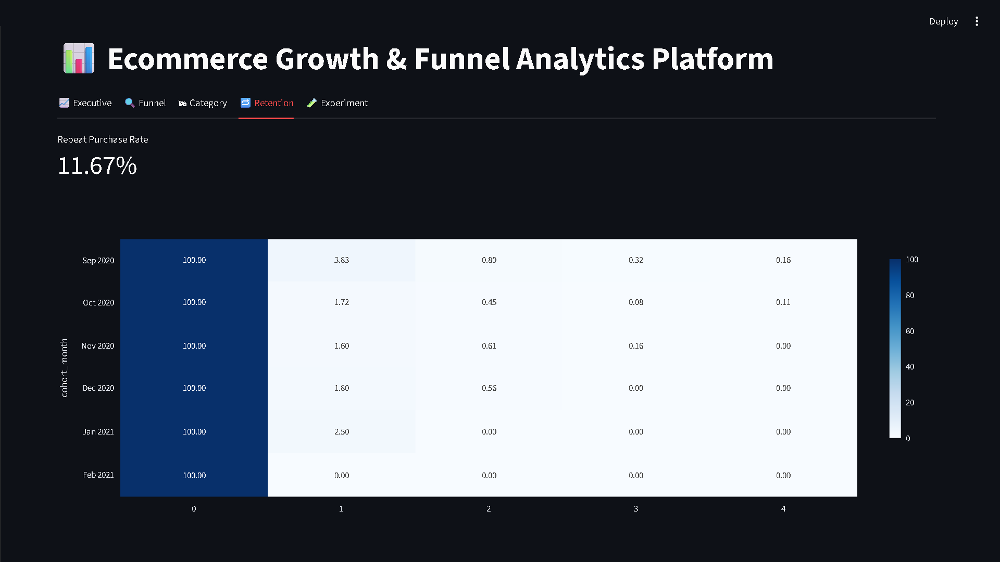
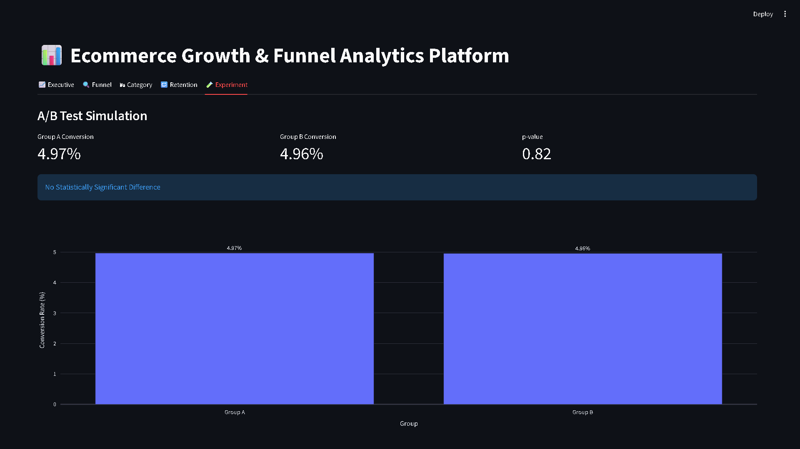

# 📈 Marketing Funnel & Conversion Drop-Off Analyzer

### AI-Powered Growth Intelligence • Funnel Analytics • Conversion Intelligence • Retention Analytics

---

<div align="center">



<br/>
<i>Growth Intelligence Platform for Funnel Analytics, Conversion Optimization & Ecommerce KPI Monitoring</i>

<br/>


</div>

---

# 🖼️ Project Overview

An enterprise-style ecommerce growth analytics platform designed to simulate real-world customer journey analytics, funnel intelligence workflows, conversion optimization systems, retention analysis, and experimentation-based growth decision-making.

This project focuses on:
- ecommerce funnel analytics
- conversion drop-off intelligence
- customer journey analysis
- retention analytics
- growth experimentation
- category performance intelligence
- executive KPI monitoring
- revenue trend analytics

Built using:
- Streamlit
- Plotly
- Pandas & NumPy
- Scikit-learn
- Matplotlib & Seaborn

---

# 🚀 Key Business Capabilities

- Funnel conversion analytics
- Customer journey intelligence
- Conversion drop-off analysis
- Revenue trend monitoring
- Ecommerce KPI tracking
- Retention intelligence
- Category performance analytics
- Experimentation analytics dashboards

---

# 💼 Business Problem

Ecommerce and digital businesses often struggle to:

- identify funnel drop-off points
- improve customer conversion rates
- understand customer journey behavior
- monitor retention performance
- optimize experimentation workflows
- analyze category-level performance
- improve growth decision-making visibility

Without growth analytics systems, organizations may face:
- lower conversion efficiency
- weak funnel visibility
- poor retention monitoring
- ineffective experimentation workflows
- limited customer journey intelligence
- reduced revenue optimization visibility

This project demonstrates how analytics-driven growth intelligence systems can support:
- conversion optimization
- ecommerce growth analytics
- customer journey intelligence
- retention-focused business strategies
- experimentation-driven decision-making

---

# 📈 Business Impact

This platform helps organizations analyze:
- conversion performance
- funnel drop-off behavior
- ecommerce revenue trends
- customer retention patterns
- experimentation outcomes
- category-level growth intelligence

The platform demonstrates how growth analytics workflows can improve:
- conversion optimization
- customer acquisition efficiency
- retention monitoring
- ecommerce decision-making
- product/category growth visibility

---

# 🧩 Multi-Module Growth Analytics Dashboard

| Module                   | Function                                  |
|--------------------------|-------------------------------------------|
| 📊 Executive Dashboard   | Ecommerce KPIs & growth metrics           |
| 🔍 Funnel Analytics      | Conversion funnel monitoring              |
| 🛒 Category Intelligence | Product category performance analytics    |
| 🔁 Retention Analytics   | Customer retention monitoring             |
| 🧪 Experiment Dashboard  | Growth experimentation analytics          |
| 💰 Revenue Intelligence  | Revenue trend & conversion analytics      |
| 🌐 Streamlit Dashboard   | Interactive growth intelligence interface |

---

# 📸 Platform Screenshots

## ⭐ Executive Growth Dashboard

<div align="center">
  
</div>

---

## ⭐ Funnel Conversion Intelligence

<div align="center">
  
</div>

---

## ⭐ Ecommerce Category Intelligence

<div align="center">
  
</div>

---

## ⭐ Retention & Customer Journey Analytics

<div align="center">
  
</div>

---

## ⭐ Experimentation & Growth Analytics

<div align="center">
  
</div>

---

# 📊 Key Funnel & Growth Insights

The analysis revealed several important ecommerce growth patterns:

### 🔹 Funnel drop-offs significantly impacted conversion performance

The largest user drop-off occurred during the checkout transition stage.

### 🔹 Revenue trends aligned closely with session growth

Higher customer session activity positively influenced monthly revenue growth.

### 🔹 Retention analytics revealed repeat engagement opportunities

Retention analysis identified opportunities for:
- re-engagement campaigns
- loyalty optimization
- retention-focused marketing

### 🔹 Category analytics improved product visibility

Certain product categories consistently outperformed others in:
- revenue generation
- conversion rates
- session engagement

### 🔹 Experimentation analytics supported growth optimization

Experiment dashboards improved visibility into:
- campaign performance
- conversion optimization
- user engagement experiments

These insights support:
- growth optimization
- customer journey intelligence
- retention monitoring
- ecommerce KPI visibility
- experimentation-driven analytics

---

# 🧬 Growth Intelligence Workflow

```text
Synthetic Ecommerce Event Data
            ↓
Data Cleaning & Preprocessing
            ↓
Session & Funnel Analytics
            ↓
Conversion Drop-Off Analysis
            ↓
Revenue & KPI Intelligence
            ↓
Retention Analytics
            ↓
Experimentation Analytics
            ↓
Interactive Streamlit Dashboard
            ↓
Growth Decision Intelligence
```

---

# 🧠 Tech Stack

| Category         | Technologies                |
|------------------|-----------------------------|
| Language         | Python 3.10+                |
| Data Analysis    | Pandas, NumPy               |
| Visualization    | Plotly, Matplotlib, Seaborn |
| Dashboard/UI     | Streamlit                   |
| Machine Learning | Scikit-learn                |
| Analytics        | Funnel & Growth Analytics   |

---

# 📁 Project Structure

```text
Marketing-Funnel-Conversion-Analyzer/
│
├── data/
│   ├── raw/
│   └── processed/
│
├── dashboard/
│   └── app.py
│
│
├── outputs/
│   ├── monthly_revenue_trend.html
│   ├── monthly_revenue_trend.png
│   ├── funnel_analysis.html
│   ├── funnel_analysis.png
│   ├── category_conversion.html
│   ├── category_conversion.png
│   ├── cohort_retention.html
│   ├── cohort_retention.png
│   ├── ab_test_results.html
│   ├── ab_test_results.png
│   ├── brand_revenue.py
│   └── summary_metrics.py
│
│
├── screenshots/
│   ├── dashboard_overview.png
│   ├── funnel_analytics.png
│   ├── category_analytics.png
│   ├── retention_analytics.png
│   └── experiment_dashboard.png
│
├── src/
│   ├── main.py
│   ├── data_cleaning.py
│   ├── funnel_engineering.py
│   └── metrics_engineering.py
│
├── requirements.txt
├── .gitignore
└── README.md
```

---

# ⚙️ Installation

## 1️⃣ Clone Repository

```bash
git clone https://github.com/girishshenoy16/Marketing-Funnel-Conversion-Analyzer.git
cd Marketing-Funnel-Conversion-Analyzer
```

---

## 2️⃣ Create Virtual Environment

```bash
python -m venv venv
venv\Scripts\activate
```

---

## 3️⃣ Install Dependencies

```bash
python.exe -m pip install --upgrade pip
pip install -r requirements.txt
```

---

## 4️⃣ Run Complete Growth Analytics Pipeline

```bash
python src/main.py
```

This executes:
- preprocessing workflows
- funnel analytics
- drop-off detection
- retention analytics
- category intelligence
- KPI engineering
- experimentation analytics
- visualization workflows

Outputs are saved in:
```plaintext
outputs/
```

---

## 5️⃣ Launch Growth Analytics Dashboard

```bash
streamlit run dashboard/app.py
```

Dashboard includes:
- executive KPI dashboards
- funnel analytics
- retention intelligence
- category performance monitoring
- experimentation analytics

---

# 🧰 Dashboard Walkthrough

## ✔ Executive Growth Dashboard

Monitor:
- total sessions
- total revenue
- conversion rate
- ecommerce KPI trends

---

## ✔ Funnel Analytics

Analyze:
- conversion drop-offs
- customer journey behavior
- funnel stage performance
- conversion bottlenecks

---

## ✔ Category Intelligence

Monitor:
- category performance
- revenue contribution
- conversion effectiveness
- engagement metrics

---

## ✔ Retention Analytics

Explore:
- repeat engagement behavior
- customer retention patterns
- retention-focused KPI insights

---

## ✔ Experiment Dashboard

Analyze:
- growth experiments
- campaign performance
- conversion optimization insights

---

# 🔮 Future Scope

- Real-time ecommerce analytics pipelines
- A/B testing optimization systems
- Recommendation engine integration
- Customer churn intelligence
- Product personalization analytics
- Marketing attribution analytics
- Growth experimentation automation

---

# 🤝 Contribution

Contributions, suggestions, and improvements are welcome.

If you found this project valuable, consider starring the repository.

---

<div align="center">

### ⚡ Growth Intelligence & Funnel Analytics for Ecommerce Optimization

</div>